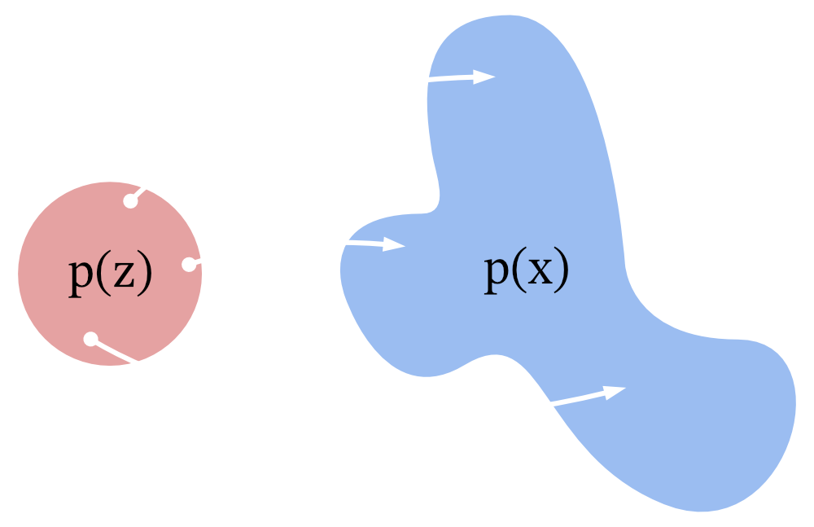
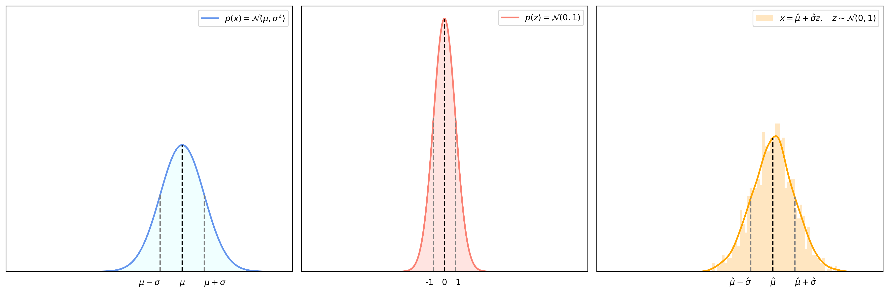
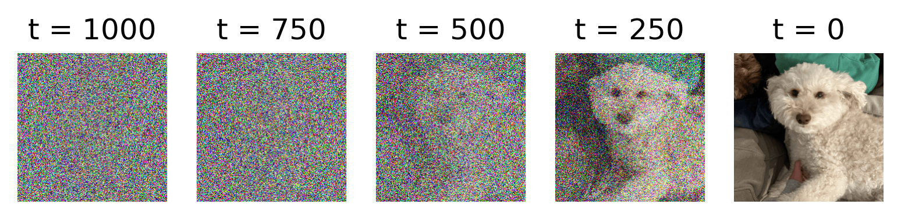
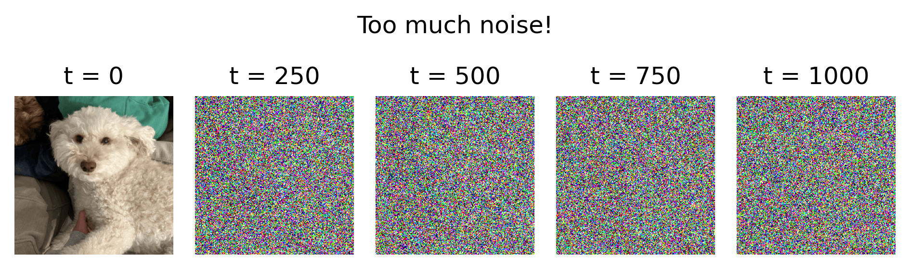
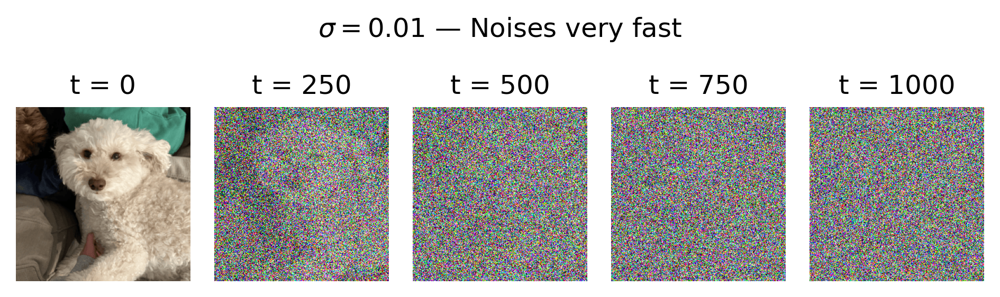
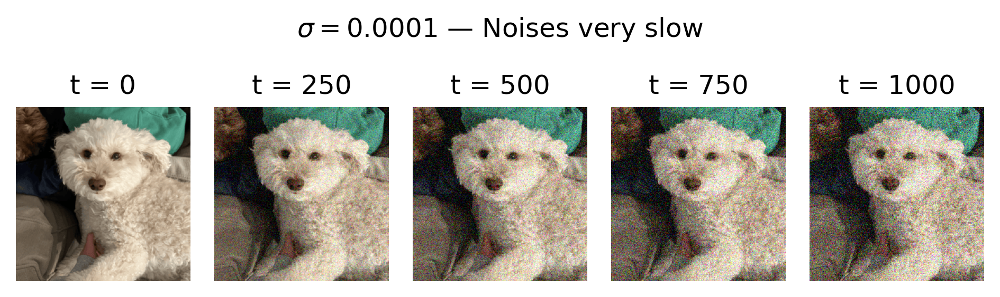
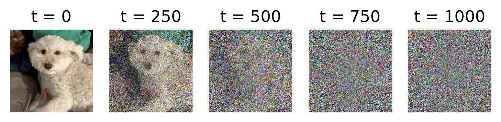
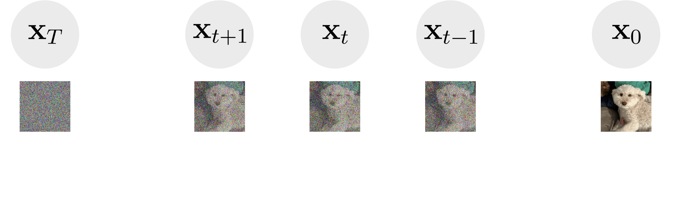

# Getting Started

## Installation
* Clone this repo:
```
git clone https://github.com/loganbrenningmeyer/diffusion.git
cd diffusion
```

* Install dependencies or create/activate a new Conda environment with:
```
conda env create -f environment.yml
conda activate diffusion
```

## Training
* Login to wandb / set environment variables:
```
wandb login

export WANDB_ENTITY="<entity>"
export WANDB_PROJECT="<project>"
```

* Configure `configs/train.yml` and launch train script:
```
sh scripts/train.sh
```

## Testing
* Configure `configs/test.yml` and launch test script:
```
sh scripts/test.sh
```

# Diffusion Models

A **denoising diffusion probabilistic model (DDPM)** [(Ho et al., 2020)](https://arxiv.org/abs/2006.11239), is a generative model that produces samples by iteratively denoising Gaussian noise. 

<div align="center">
    
    <p align="center">Diffusion model trained on CIFAR10 for 800k steps</p>
</div>

## What is the goal?

All generative models share the same goal: **learn how to produce samples from some true distribution**, e.g., "here's lots of photos of dogs, now make me a new one." Diffusion models are no different, but they don't simply pull a dog out of thin air, they begin with pure noise and repeatedly denoise it until, ideally, it is "dog-like."

Let's call the true distribution $p(\mathbf{x})$, e.g., a distribution of dog images where $\mathbf{x} \sim p(\mathbf{x})$ is a sample image of a dog. To generate new samples, we want to learn how to **sample a latent variable $\mathbf{z}$** from some random, easy-to-sample distribution $p(\mathbf{z})$—often a standard normal distribution $\mathbf{z} \sim \mathcal{N}(0,\mathbf{I})$—and **transform it into a sample from the true distribution**.

<div align="center">
    
    <p align="center">Mapping samples from p(z) to the true distribution p(x)</p>
</div>

However, actually knowing $p(\mathbf{x})$ is intractable—you can't know every possible dog image. So we want to create a model with parameters $\theta$ that approximates $p_\theta(\mathbf{x}|\mathbf{z})$ given a random latent $\mathbf{z} \sim p(\mathbf{z})$, i.e., "given some noise, what clean images does it likely map to?". This allows us to produce new samples $\mathbf{x} \sim p_\theta(\mathbf{x}|\mathbf{z})$ using our model.

## Simplifying the Problem

In a perfect world, our model could learn to produce a perfect sample from the true distribution in one shot from any given latent $\mathbf{z}$. In very simple cases, this perfect world actually exists. If $p(x)$ were simply a one-dimensional normal distribution $x \sim \mathcal{N}(\mu,\sigma^2)$, our model could easily predict the mean $\hat{\mu}$ and variance $\hat{\sigma}^2$ of $p(x)$. We could then simply create new samples by:

1. Sampling a latent $z \sim \mathcal{N}(0,1)$ 
2. Producing a sample $x = \hat{\mu} + \hat{\sigma}z$ 

<div align="center">
    
    <p align="center">Generating new samples from a 1-D normal distribution using the learned mean and variance</p>
</div>

In practice, $p(\mathbf{x})$ is a highly complex, high-dimensional distribution ($256\times256\text{px}$ RGB images have 196,608 dimensions!), so it is impossible to perfectly map $\mathbf{z} \sim p(\mathbf{z}) \to \mathbf{x} \sim p(\mathbf{x})$. Therefore, we can try to simplify the problem by moving from $\mathbf{z} \to \mathbf{x}$ in *very small* steps.

### Incremental Steps

Let's try and break the problem into $T$ steps, incrementally transforming $\mathbf{z}$ many times until we reach $x$. In diffusion models, we sample $\mathbf{z} \sim \mathcal{N}(0,\mathbf{I})$, beginning with pure Gaussian noise with zero-mean and unit-variance. We'll call the target variable $\mathbf{x}_0$—the clean image after $T$ incremental steps of denoising $\mathbf{z}$. To keep things in terms of $T$, we'll refer to our starting latent $\mathbf{z}$ as $\mathbf{x}_T$ from now on—the pure Gaussian noise we want to clean up. Therefore, the incremental process we hope to perform is:

$$\mathbf{x}_T \to \mathbf{x}_{T-1} \to \ldots \to \mathbf{x}_1 \to \mathbf{x}_0$$

This greatly simplifies our model's task, as it now simply needs to learn the conditional distribution

$$\boxed{{\mathbf{x}_{t-1} \sim p_\theta(\mathbf{x}_{t-1}|\mathbf{x}_t)}},$$

meaning "given the current noisy $\mathbf{x}_t$, what is the distribution of the slightly less noisy $\mathbf{x}_{t-1}$?" Rather than trying to guess the correct clean image from pure noise—an impossible task—the model only predicts a slightly denoised version of the current image.

<div align="center">
    
    <p align="center">Denoising from pure noise to a clean image</p>
</div>

### Learning to Denoise

But how do we train a model to denoise images? Let's say we have a training dataset $\mathcal{D}$ of clean images $\mathbf{x}_0 \in \mathcal{D}$, and we need to provide the model with lots of examples of denoising from $\mathbf{x}_{t} \to \mathbf{x}_{t-1}$. However, since we don't have some true dataset of noisy $\mathbf{x}_t$ samples, we'll have to make them ourselves. This is known as the **forward diffusion process**, the process of iteratively noising clean samples.

## Forward Process

So let's make some noise! We'll start with the clean image $\mathbf{x}_0$ at $t=0$ and add noise at each step until we reach $\mathbf{x}_T$ at $t=T$, where we want $\mathbf{x}_T$ to be pure Gaussian noise, $\mathbf{x}_T \sim \mathcal{N}(0,\mathbf{I})$. Keep in mind, we will be feeding $\mathbf{x}_t$ into a neural network, which learns best from normalized data. Therefore, we want to ensure $\mathbf{x}_t$ is normalized at every step to have zero-mean and unit-variance, meaning we want:

$$E[\mathbf{x}_t]=0,\quad \text{Var}[\mathbf{x}_t]=1,\quad t=0,1,\ldots,T$$

### Adding Noise

Let's start out simple by adding some standard Gaussian noise at each step, scaled to have some variance $\sigma^2$:

$$\mathbf{x}_t = \mathbf{x}_{t-1} + \sigma\boldsymbol{\epsilon}_t,\quad \boldsymbol{\epsilon}_t \sim \mathcal{N}(0,\mathbf{I})$$

This may seem like a good idea at first glance, but naively adding the same Gaussian noise at every step means the variance of $\mathbf{x}_t$ increases linearly over time:

$$
\begin{aligned}
\text{Var}[\mathbf{x}_0] &= 1 \\
\text{Var}[\mathbf{x}_1] &= \text{Var}[\mathbf{x}_0 + \sigma\boldsymbol{\epsilon}_1] = \text{Var}[\mathbf{x}_0] + \sigma^2 = 1 + \sigma^2 \\
\text{Var}[\mathbf{x}_2] &= \text{Var}[\mathbf{x}_1 + \sigma\boldsymbol{\epsilon}_2] = \text{Var}[\mathbf{x}_1] + \sigma^2 = 1 + 2\sigma^2 \\
\vdots \\
\text{Var}[\mathbf{x}_t] &= \text{Var}[\mathbf{x}_{t-1} + \sigma\boldsymbol{\epsilon}_t] = \text{Var}[\mathbf{x}_{t-1}] + \sigma^2 = \boxed{1 + t\sigma^2}
\end{aligned}
$$

This means that at timestep $t$, the noisy image's values are roughly in the range $[-1-t\sigma^2,\ 1+t\sigma^2]$, making the magnitudes of pixel-values *much* larger than they should be: 

<div align="center">
    
    <p align="center">Adding the same Gaussian noise at each step linearly increases variance</p>
</div>

### Preserving Variance

But remember, we want keep each $\mathbf{x}_t$ properly normalized to have $E[\mathbf{x}_t]=0$ and $\text{Var}[\mathbf{x}_t]=1$. So let's keep $\mathbf{x}_t$'s values in check by introducing a scaling factor $c<1$ to shrink $\mathbf{x}_t$ towards 0:

$$\mathbf{x}_t = c\mathbf{x}_{t-1} + \sigma\boldsymbol{\epsilon}_t,\quad \boldsymbol{\epsilon}_t \sim \mathcal{N}(0,\mathbf{I})$$

We want $\text{Var}[\mathbf{x}_t]=1$ at every timestep $t$, so we can solve for the $c$ that keeps it that way:

$$
\begin{aligned}
\text{Var}[\mathbf{x}_t] = 1 &= \text{Var}[c\mathbf{x}_{t-1} + \sigma\boldsymbol{\epsilon}_t] \\
&= \text{Var}[c\mathbf{x}_{t-1}] + \text{Var}[\sigma\boldsymbol{\epsilon}_t] \\
&= c^2\underbrace{\text{Var}[\mathbf{x}_{t-1}]}_{1} + \sigma^2\underbrace{\text{Var}[\boldsymbol{\epsilon}_t]}_{1}
\end{aligned}
$$

$$
\begin{aligned}
1 &= c^2 + \sigma^2 \\
c &= \boxed{\sqrt{1 - \sigma^2}}
\end{aligned}
$$

Now if we substitute in $c = \sqrt{1-\sigma^2}$, we can double check that our math works out such that $\text{Var}[\mathbf{x}_t]=1$:

* Substitute $c=\sqrt{1-\sigma^2}$:

$$\mathbf{x}_t = \sqrt{1 - \sigma^2}\mathbf{x}_{t-1} + \sigma\boldsymbol{\epsilon}_t,\quad \boldsymbol{\epsilon}_t \sim \mathcal{N}(0,\mathbf{I})$$

* Compute $\text{Var}[\mathbf{x}_t]$:

$$
\begin{aligned}
\text{Var}[\mathbf{x}_t] &= \text{Var}[\sqrt{1 - \sigma^2}\mathbf{x}_{t-1} + \sigma\boldsymbol{\epsilon}_t] \\
&= \text{Var}[\sqrt{1 - \sigma^2}\mathbf{x}_{t-1}] + \text{Var}[\sigma\boldsymbol{\epsilon}_t] \\
&= (1 - \sigma^2)\underbrace{\text{Var}[\mathbf{x}_{t-1}]}_{1} + \sigma^2\underbrace{\text{Var}[\boldsymbol{\epsilon}_t]}_{1} \\
&= 1 - \sigma^2 + \sigma^2 \\
&= \boxed{1}
\end{aligned}
$$

### Variance Schedule

*Great! So we can just pick some variance* $\sigma^2$ *for our noise, scale* $\mathbf{x}_{t-1}$ *by* $\sqrt{1-\sigma^2}$ *at each step, and everything works out!* Unfortunately, there are a few issues with that:

1. If $\sigma=1$, then $\sqrt{1-\sigma^2} = 0$, and $\mathbf{x}_{t-1}$ is completely removed at every step—we'd only have noise from $t=1$ onwards.
2. Even if $\sigma<1$, say $\sigma=0.01$, the image gets noisy way too quickly, but we want our model to see smooth, subtle steps of noise.

<div align="center">
    
    <p align="center"></p>
</div>

3. If $\sigma\ll1$, say $\sigma=0.0001$, the image gets noisy way too slowly, and our model never sees pure noise. 

<div align="center">
    
    <p align="center"></p>
</div>

We need to find a compromise: we want the model to see timesteps with little noise and timesteps with lots of noise, and we want the noise to be added smoothly over time. Therefore, we need a **variance schedule** to control how much noise is added at each timestep. So instead of a fixed variance $\sigma^2$ at all timesteps, we'll introduce $\beta_t$ as the variance at timestep $t$. For notation convenience, we'll also let $\alpha_t = 1 - \beta_t$. By scheduling the variance of the noise, our old equation,

$$\mathbf{x}_t = \sqrt{1 - \sigma^2}\mathbf{x}_{t-1} + \sigma\boldsymbol{\epsilon}_t,\quad \boldsymbol{\epsilon}_t \sim \mathcal{N}(0,\mathbf{I}),$$

now becomes,

$$\boxed{\mathbf{x}_t = \sqrt{\alpha_t}\mathbf{x}_{t-1} + \sqrt{\beta_t}\boldsymbol{\epsilon}_t,\quad \boldsymbol{\epsilon}_t \sim \mathcal{N}(0,\mathbf{I})}$$

A single step can also be written as the conditional distribution:

$$\boxed{q(\mathbf{x}_t|\mathbf{x}_{t-1}) \sim \mathcal{N}(\sqrt{\alpha_t}\mathbf{x}_{t-1},\ \beta_t I)}$$

meaning that given the previous sample $\mathbf{x}_{t-1}$, the next sample $\mathbf{x}_t$ is sampled from a normal distribution with mean $\sqrt{\alpha_t}\mathbf{x}_{t-1}$ and variance $\beta_t$.

### Closed-Form Forward Equation

At each step, $\mathbf{x}_{t-1}$ is scaled by $\sqrt{\alpha_t}$, which means we keep $\sqrt{\alpha_t}$ of $\mathbf{x}_{t-1}$ at each noising step, i.e., its retained signal is $\sqrt{\alpha_t}\mathbf{x}_{t-1}.$ If we start at $\mathbf{x}_0$ and add noise for $t=1,2,\ldots,T$, we can see how much of the *original signal* we retain:

$$
\begin{align*}
\mathbf{x}_1 &= \sqrt{\alpha_1}\mathbf{x}_0 + \sqrt{\beta_1}\boldsymbol{\epsilon}_1 \\
\mathbf{x}_2 &= \sqrt{\alpha_2}(\sqrt{\alpha_1}\mathbf{x}_0 + \sqrt{\beta_1}\boldsymbol{\epsilon}_1) + \sqrt{\beta_2}\boldsymbol{\epsilon}_2 \\
\mathbf{x}_3 &= \sqrt{\alpha_3}(\sqrt{\alpha_2}(\sqrt{\alpha_1}\mathbf{x}_0 + \sqrt{\beta_1}\boldsymbol{\epsilon}_1) + \sqrt{\beta_2}\boldsymbol{\epsilon}_2) + \sqrt{\beta_3}\boldsymbol{\epsilon}_3 \\
\vdots \\
\end{align*}
$$

As you can see, at each timestep $t$, $\mathbf{x}_0$ is scaled by the cumulative product $\sqrt{\alpha_1} \cdot \sqrt{\alpha_2} \cdot \sqrt{\alpha_3} \cdots \sqrt{\alpha_t}.$ We can then define the retained signal of $\mathbf{x}_0$ at timestep $t$ as $\sqrt{\bar\alpha_t}\mathbf{x}_0$, where

$$\bar\alpha_t = \prod_{s=1}^t \alpha_s$$

The variance of the retained signal of $\mathbf{x}_0$ is then $\text{Var}[\sqrt{\bar\alpha_t}\mathbf{x}_0]=\bar\alpha_t$. Since we've defined the forward diffusion process so that the total variance of $\mathbf{x}_t$ is always $1$, and because $\mathbf{x}_t$ is simply the retained signal from $\mathbf{x}_0$ at timestep $t$ plus noise, we can say:

$$\text{Var}[\text{signal}_t] + \text{Var}[\text{noise}_t] = 1$$

We've just defined that $\text{Var}[\text{signal}_t]=\bar\alpha_t$, so we can then solve for the variance of the noise at timestep $t$:

$$
\begin{align*}
\bar\alpha_t + \text{Var}[\text{noise}_t] &= 1 \\
\text{Var}[\text{noise}_t] &= 1 - \bar\alpha_t
\end{align*}
$$

Now we can make a closed-form equation for $\mathbf{x}_t$ from $\mathbf{x}_0$ without having to noise every step individually!

$$\boxed{\mathbf{x}_t = \sqrt{\bar\alpha_t}\mathbf{x}_0 + \sqrt{1 - \bar\alpha_t}\boldsymbol{\epsilon},\quad \boldsymbol{\epsilon} \sim \mathcal{N}(0,\mathbf{I})}$$

### Planning the Variance Schedule

As the variance of the retained signal and the variance of the noise sum to $1$, the signal variance $\bar\alpha_t$ provides a good measure of how much of the clean image the model can see compared to noise at timestep $t$. Therefore, we want $\bar\alpha_t$ to decrease smoothly over time, allowing the model to see the clean image nicely transition into noise. So we must define a variance schedule $\{\beta_t\}_{t=1}^T$ that makes $\bar\alpha_t$ smoothly decay. Recall that $\alpha_t = 1 - \beta_t$, so we can write $\bar\alpha_t$ as:

$$\bar\alpha_t = \prod_{s=1}^t 1 - \beta_t$$

Clearly, as $\beta_t$ increases, $\bar\alpha_t$ decreases, so how should we increase $\beta_t$? In the original DDPM paper, they went with the simplest route: linearly increase $\beta_t$. They empirically chose to start with $\beta_1=0.0001$ and end with $\beta_T=0.02$ over $T=1000$ steps, simply picking these values to ensure that:

1. At the start, $\bar\alpha_1 = 0.9999$, meaning $\mathbf{x}_1$ is nearly a completely clean image.
2. By the end, $\bar\alpha_T \approx 0.00004$, meaning $\mathbf{x}_T$ is essentially pure noise.
3. $\bar\alpha_t$ exponentially decays smoothly over time, which is helpful for our model to learn. 

<div align="center">
    
    
    <p align="center">
        Linear variance schedule with &beta;<sub>1</sub>=0.0001, &beta;<sub>T</sub>=0.02
    </p>
</div>

Now we have a way to generate training samples! We can just use our linear variance schedule and our closed-form forward equation to produce any $\mathbf{x}_t$ from $\mathbf{x}_0$.

## Reverse Process

Recall that a single step of the forward noising process is defined as:

$$q(\mathbf{x}_t|\mathbf{x}_{t-1}) \sim \mathcal{N}(\sqrt{\alpha_t}\mathbf{x}_{t-1},\ \beta_t I).$$

Our goal is to train our model to learn $p(\mathbf{x}_{t-1}|\mathbf{x}_t)$, i.e., the reverse of the forward process. According to Bayes' Rule, we can solve for $p(\mathbf{x}_{t-1}|\mathbf{x}_t)$ with:

$$p(\mathbf{x}_{t-1}|\mathbf{x}_t) = \frac{q(\mathbf{x}_t|\mathbf{x}_{t-1})p(\mathbf{x}_{t-1})}{p(\mathbf{x}_t)}.$$

Just as we can't know the distribution of all dogs $p(\mathbf{x})$, we can't know the distribution of all noisy dogs $p(\mathbf{x}_t)$—it is intractable—so we'll ignore the normalizing term in the denominator and write:

$$p(\mathbf{x}_{t-1}|\mathbf{x}_t) \propto q(\mathbf{x}_t|\mathbf{x}_{t-1})p(\mathbf{x}_{t-1}).$$

### Gaussian Assumption

Here we make a key assumption about the distribution $p(\mathbf{x}_{t-1}|\mathbf{x}_t)$ that makes all of this work—it is Gaussian. 

Technically, $q(\mathbf{x}_t\vert\mathbf{x}_{t-1})$ defines the forward distribution for $\mathbf{x}_t$, asking: "*What is the slightly noisier version of* $\mathbf{x}_{t-1}$*?*" However, in the reverse process we *only know* $\mathbf{x}_t$ and want to *predict* $\mathbf{x}_{t-1}$. In that case, $q(\mathbf{x}_t|\mathbf{x}_{t-1})$ acts as the **likelihood** of $\mathbf{x}_{t-1}$, instead asking: "*What previous sample likely produced* $\mathbf{x}_t$*?*" 

As we know from the forward process, $\mathbf{x}_t$ is just a scaled-down version of the previous image $\sqrt{\alpha_t}\mathbf{x}_{t-1}$ plus a little bit of noise. Therefore, given $\mathbf{x}_t$, it's reasonable to believe that the previous image was likely around $\frac{\mathbf{x}_t}{\sqrt{\alpha_t}}$—the current image scaled back up. Because we made the crucial design choice to split up the problem into many *very, very small* steps, this approximation is very accurate. As a result, $q(\mathbf{x}_t|\mathbf{x}_{t-1})$, the likelihood of $\mathbf{x}_{t-1}$ given $\mathbf{x}_t$, is a sharp Gaussian spike around $\frac{\mathbf{x}_t}{\sqrt{\alpha_t}}$ and nearly $0$ everywhere else.

The data distribution $p(\mathbf{x}_{t-1})$ is itself intractable like $p(\mathbf{x}_t)$—it is the complex, curved manifold of all valid $\mathbf{x}_{t-1}$ samples. However, multiplying it with the narrow Gaussian spike $q(\mathbf{x}_t|\mathbf{x}_{t-1})$ effectively "zooms in" very closely around $\frac{\mathbf{x}_t}{\sqrt{\alpha_t}}$, where $p(\mathbf{x}_{t-1})$ is essentially flat or constant. 

Multiplying the Gaussian spike $q(\mathbf{x}_t|\mathbf{x}_{t-1})$ with the locally constant region of $p(\mathbf{x}_{t-1})$ is just a scaled Gaussian, meaning $p(\mathbf{x}_{t-1}|\mathbf{x}_t)$ is Gaussian as well! This is very convenient, as to train our model to represent $p_\theta(\mathbf{x}_{t-1}|\mathbf{x}_t)$, we only need to know the mean and variance that define the Gaussian distribution!

$$p_\theta(\mathbf{x}_{t-1}|\mathbf{x}_t) = \mathcal{N}(\boldsymbol{\mu}_\theta(\mathbf{x}_t,t),\ \Sigma_\theta(\mathbf{x}_t,t))$$

### Computing Variance

Luckily, we don't need to predict $\Sigma_\theta(\mathbf{x}_t,t)$ using the model; we can compute it analytically. In the original DDPM paper, they experimented with two formulations:

1. **Forward Variance**: The variance $\beta_t$ defined by the variance schedule, assumes no knowledge of $\mathbf{x}_0$.

$$\boxed{\Sigma_\theta(\mathbf{x}_t,t) = \beta_t}$$

2. **Posterior Variance**: The true posterior variance assuming that we know $\mathbf{x}_0$, reflecting how much uncertainty we have given $\mathbf{x}_0$ at each denoising step: $\tilde\beta_T \approx \beta_T$, $\tilde\beta_1 \approx 0$.

$$\boxed{\Sigma_\theta(\mathbf{x}_t,t) = \tilde\beta_t =  \frac{1 - \bar\alpha_{t-1}}{1 - \bar\alpha_t}\beta_t}$$

### Computing the Posterior Mean

Recall that in the forward process, we produce $\mathbf{x}_t$ from $\mathbf{x}_{t-1}$ with:

$$\mathbf{x}_t = \sqrt{\alpha_t}\mathbf{x}_{t-1} + \sqrt{\beta_t}\boldsymbol{\epsilon}_t,\quad \boldsymbol{\epsilon}_t \sim \mathcal{N}(0,\mathbf{I})$$

Our goal is to compute the mean of the previous image, so let's solve for $\mathbf{x}_{t-1}$,

$$\mathbf{x}_{t-1} = \frac{1}{\sqrt{\alpha_t}}(\mathbf{x}_t - \sqrt{\beta_t}\boldsymbol{\epsilon}_t)$$

then let's take the expectation given the current image $\mathbf{x}_t$:

$$
\begin{aligned}
\mathbb{E}[\mathbf{x}_{t-1}|\mathbf{x}_t] &= \mathbb{E}\Bigl[\frac{1}{\sqrt{\alpha_t}}(\mathbf{x}_t - \sqrt{\beta_t}\boldsymbol{\epsilon}_t)|\mathbf{x}_t\Bigr] \\
\mathbb{E}[\mathbf{x}_{t-1}|\mathbf{x}_t] &= \frac{1}{\sqrt{\alpha_t}}(\mathbf{x}_t - \sqrt{\beta_t}\mathbb{E}[\boldsymbol{\epsilon}_t|\mathbf{x}_t])
\end{aligned}
$$

Now, our only unknown in the right-hand side of the equation is $\mathbb{E}[\boldsymbol{\epsilon}_t|\mathbf{x}_t]$, the expected value of the noise added at step $t$. Instead of training our model to predict the mean itself, we can train it to predict $\boldsymbol{\epsilon}_\theta(\mathbf{x}_t,t)$, the total noise added from $\mathbf{x}_0$ to $\mathbf{x}_t$. As in the equations above, we know that the standard deviation of the noise added at step $t$ is $\sqrt{\beta_t}.$ We also know that the standard deviation of the total noise added from $\mathbf{x}_0$ to $\mathbf{x}_t$ is $\sqrt{1 - \bar\alpha_t}.$ Therefore, if we want to scale our model's predicted total noise $\boldsymbol{\epsilon}_\theta(\mathbf{x}_t,t)$ down to the noise only at step $t$, we can multiply it by step $t$'s proportion of the total noise, $\frac{\sqrt{\beta_t}}{\sqrt{1-\bar\alpha_t}}:$

$$\mathbb{E}[\boldsymbol{\epsilon}_t|\mathbf{x}_t] \approx \frac{\sqrt{\beta_t}}{\sqrt{1-\bar\alpha_t}}\boldsymbol{\epsilon}_\theta(\mathbf{x}_t,t)$$

If we plug that into the mean equation $\mathbb{E}[\mathbf{x}_{t-1}|\mathbf{x}_t]$, we arrive at the equation for $\boldsymbol{\mu}_\theta(\mathbf{x}_t,t):$

$$
\begin{aligned}
\boldsymbol{\mu}_\theta(\mathbf{x}_t,t) &= \frac{1}{\sqrt{\alpha_t}}\Bigl(\mathbf{x}_t - \sqrt{\beta_t}\frac{\sqrt{\beta_t}}{\sqrt{1 - \bar\alpha_t}}\boldsymbol{\epsilon}_\theta(\mathbf{x}_t,t)\Bigr) \\
&= \boxed{\frac{1}{\sqrt{\alpha_t}}\Bigl(\mathbf{x}_t - \frac{\beta_t}{\sqrt{1 - \bar\alpha_t}}\boldsymbol{\epsilon}_\theta(\mathbf{x}_t,t)\Bigr)}
\end{aligned}
$$

### Denoising Step

To then perform a DDPM denoising step and obtain $\mathbf{x}_{t-1}$, you simply produce a sample with mean $\boldsymbol{\mu}_\theta$ and added Gaussian noise with variance $\tilde\beta_t:$

$$
\begin{aligned}
\mathbf{x}_{t-1} &= \boldsymbol{\mu}_\theta(\mathbf{x}_t,t) + \sqrt{\tilde\beta_t}\mathbf{z},\quad \mathbf{z} \sim \mathcal{N}(0,\mathbf{I}) \\
\mathbf{x}_{t-1} &= \boxed{\frac{1}{\sqrt{\alpha_t}}\Bigl(\mathbf{x}_t - \frac{\beta_t}{\sqrt{1-\bar\alpha_t}}\boldsymbol{\epsilon}_\theta(\mathbf{x}_t,t)\Bigl) + \sqrt{\tilde\beta_t}\mathbf{z}}
\end{aligned}
$$

## Training / Generation

To train a model to predict $\boldsymbol{\epsilon}_\theta(\mathbf{x}_t,t)$, we define the training objective simply as the mean squared error between the model's predicted noise and the true noise:

$$\boxed{L(\theta) = \mathbb{E}_{\mathbf{x}_0,t,\boldsymbol{\epsilon}}\Bigl[\Vert\boldsymbol{\epsilon} - \boldsymbol{\epsilon}_\theta(\mathbf{x}_t,t)\Vert^2\Bigr]}$$

With a trained noise prediction model, DDPM-style image generation is as simple as sampling Gaussian noise and repeatedly applying the denoising update rule until you reach a clean image!

<div align="center">
    
    <p align="center">DDPM image generation</p>
</div>

# Diffusion Slides

If you'd like to see diffusion models explained from the stochastic differential equation perspective, check out [these slides](https://docs.google.com/presentation/d/1OqrJJelGhm7FuKFeKAIcXTOgOvlkOGR9AtnScGCXeKI/edit?usp=sharing)!
